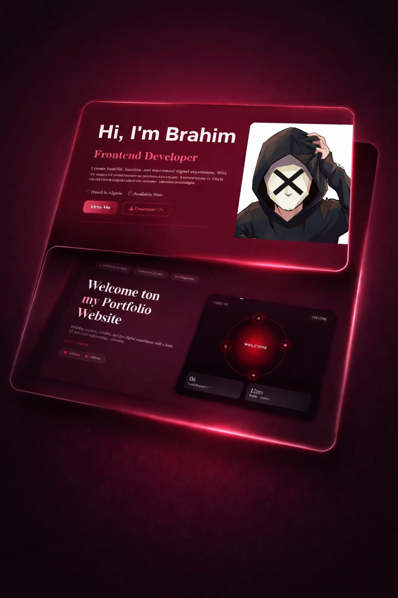

  

# Brahim Portfolio Showcase 

Welcome to Brahim's Portfolio Showcase!
A modern and elegant personal portfolio website built to present my projects, skills, and professional journey using HTML, CSS, and JavaScript.
---

## Live Demo 

You can view the live website here: [Live Demo](https://el-guemra-br.github.io)

---

## 🚀 Deploy on GitHub Pages

1. **Rename your repository** to `el-guemra-br.github.io` (go to Settings → General → Repository name)
2. **Go to Settings → Pages**
3. **Source:** Select "Deploy from a branch"
4. **Branch:** Select "main" (or "master") and folder "/" (root)
5. **Click Save** and wait 1-2 minutes for deployment

Your site will be live at: `https://el-guemra-br.github.io`

---

## Website Sections

- **Home**: Developer introduction with avatar and short description  
- **About**: Experience, tech stack, personal insights, and skill cards  
- **Projects**: Showcase of projects with images, descriptions, and skills  
- **Services**: Highlighting services offered with interactive cards  
- **Contact**: Contact form and social links with interactive hover effects  

---

## Features

- Clean & modern UI design
- Smooth animations and transitions
- Fully responsive (Desktop / Tablet / Mobile)
- Interactive sections & hover effects
- Clean and organized code structure
- Fast performance & lightweight 

---

## Technologies Used

- **HTML5** – Structure and semantic content  
- **CSS3** – Styling, responsive layouts, Flexbox & Grid  
- **JavaScript (Vanilla JS)** – Interactivity and animations  
- **Font Awesome / Boxicons** – Icons  
- **AOS.js** – Scroll animations  

---
##  How to Use / Customize

1. **Clone the repository:**

       git clone https://github.com/el-guemra-br/portfolio.github.io.git

 ---
## License

This project is licensed under the terms described in the [LICENSE](LICENSE) file.

---

##  Contact

- Email: brahimgamra11@gmail.com   
- LinkedIn: [LinkedIn](https://www.linkedin.com/in/)  
- GitHub: [GitHub](https://github.com/el-guemra-br)  
- Instagram: [Instagram](https://www.instagram.com/el_guemra_br/?utm_source=ig_web_button_share_sheet)

---

Made by **el-guemra-br**

    
